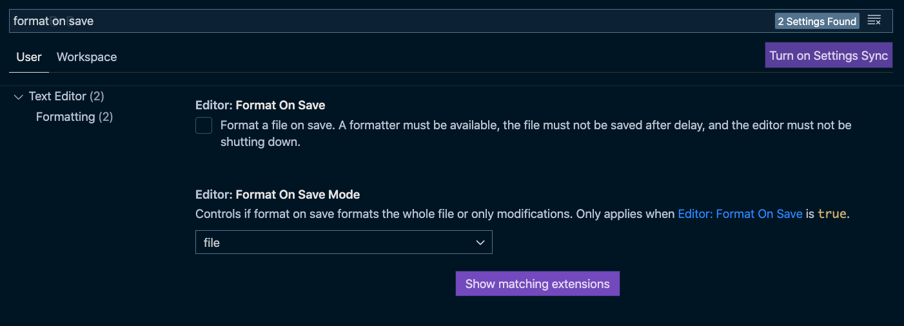

### 색션4: 최종프로젝트 - 점진적인 타입 적용
1. 타입스크립트 환경 설정 및 ts 파일로 변환
2. any 타입 선언
- 타입스크립트 설정 파일(tsconfig.js)에 ```noImplicitAny: true``` 추가
3. any 타입을 더 저절한 타입으로 변경
- > 06: Parameter 'selector' implicitly has an 'any' type. // 너가 타입에 대해서 잘모르면 any라도 넣아라
- 가능한한 구체적인 타입으로 타입 정의

##### 화살표함수에 타입 정의 방법
```
// 타입스크립트의 화살표 함수
var sum = (a: number, b: number): number => {
    return a + b;
}
```

```
// 파라미터 하나의 경우 타입 추가 할때도 괄호가 필요
sorted.forEach((value: any) => {
```

##### DOM 관련 타입 구체화(any-> 구체화된 타입으로 변경)
- 예제 참고[]
- > TS2339: Property 'innerText' does not exist on type 'Element' //현제 엘레먼트 타입이 없다
- 태그 타입은 위계적인 질서 타입을 가지고 있임
>```var a: Element | HTMLElement | HTMLParagraphElement ```

##### DOM 함수 타입 오류 해결
- HTMLParagraphElement : HTMLElement를 상속받아서 확장

### 색션5: 최종프로젝트 - 점진적인 타입 적용을 위한 프로젝트 환경 구성
## 타입스크립트 프로젝트 환경 구성

1. 프로젝트 폴더 생성
2. `npm init -y`로 `package.json` 파일 생성
3. 아래 명령어로 타입스크립트 및 문법 검사, 코드 정리 도구 라이브러리 추가

```sh
npm i -D typescript @babel/core @babel/preset-env @babel/preset-typescript @typescript-eslint/eslint-plugin @typescript-eslint/parser eslint prettier eslint-plugin-prettier
```

4. 프로젝트 폴더 바로 아래에 ESLint 설정 파일 추가
   
```js
// .eslintrc.js
module.exports = {
  root: true,
  env: {
    browser: true,
    node: true,
  },
  extends: [
    'eslint:recommended',
    'plugin:@typescript-eslint/eslint-recommended',
    'plugin:@typescript-eslint/recommended',
  ],
  plugins: ['prettier', '@typescript-eslint'],
  rules: {
    'prettier/prettier': [
      'error',
      {
        singleQuote: true,
        semi: true,
        useTabs: false,
        tabWidth: 2,
        printWidth: 80,
        bracketSpacing: true,
        arrowParens: 'avoid',
      },
    ],
  },
  parserOptions: {
    parser: '@typescript-eslint/parser',
  },
};
```

5. ESLint 이그노어 파일 추가

```
// .eslintignore
node_modules
```

## VSCode ESLint 플러그인 관련 설정
 
1. VSCode의 [ESLint 플러그인](https://marketplace.visualstudio.com/items?itemName=dbaeumer.vscode-eslint) 설치
2. VSCode에서 `ctrl` + `shift` + `p` / `cmd` + `shift` + `p` 키를 이용하여 명령어 실행 창 표시
- 웹스톰은 다른단축키인듯
3. 명령어 실행 창에 `open settings (json)` 입력 후 선택


4. VSCode 사용자 정의 파일인 `settings.json` 파일의 내용에 아래와 같이 ESLint 플러그인 관련 설정 추가.

```js
{
  // ... <-- 기존 내용을 꼭 유지한 상태에서 아래 내용을 추가하고 이 주석은 제거할 것
  "editor.codeActionsOnSave": {
      "source.fixAll.eslint": true
  },
  "eslint.alwaysShowStatus": true,
  "eslint.workingDirectories": [
      {"mode": "auto"}
  ],
  "eslint.validate": [
      "javascript",
      "typescript"
  ],
}
```

5. `ctrl` + `,` 또는 `cmd` + `,` 눌러서 VSCode 설정 파일(Settings)에 들어간 후 `format on save` 검색. 아래와 같이 체크가 안되어 있는지 확인.


- 바벨: 최신 js 문법을 많은 브러우저가 호환할수 있게 변환해줄수 잇는 도구
- preset: 플러그인의 집합?  플러그인+옵셥의 집합

##### ESlint
-코드 문법 보조 도구 => 자동 변환 => 일관된 정해진 기준으로 자동으로 변해줌
-.: 숨김파일/ rc:설정파일
- 자바스크립트 코드를 에러가 덜 나는 방향으로 작성하도록 도와주는 문법 보조 도구

##### prettier
- 개인의 취향이 들어간 코드 정리 도구
- eslint안에 쓰는 이유: 개인화를 할수 잇음?

#### 그외 정리
-D :  배포용이 아닌 개발용 설치
- esLink 플러그인 셋팅: 흐음...

TSLink 안쓰고 Eslink 사용 이유: TsLink 성능 이슈잇음, 그렇기 때문ㅇ ESLink를 얹허서 사용 

### 색션6: 최종프로젝트 - 외부 라이브러리 모듈화
- <script src="https://unpkg.com/axios/dist/axios.min.js"></script>, <script src="https://cdn.jsdelivr.net/npm/chart.js@2.8.0"></script> cdn으로 들고오는 경우 외부 ㅏ이브러리
```javascript
// // 라이브러리 로딩 => npm으로 설치후 이런식으로 들고 온다
// import 변수명 from '라이브러리 이름';
// // 변수, 함수 임포트 문법
// import {} from '파일 상대 경로';
import axios, { AxiosResponse } from 'axios';
import Chart from 'chart.js'; //
// 타입 모듈
import {
  CountrySummaryResponse,
  CovidSummaryResponse,
  Country,
  CountrySummaryInfo,
} from './covid/index';

```

- axios는 잘돌아가는데(크고 잘관리되는 라이브러이기 때문에)( 라이브러리에 대한 구현체에 대한 타입정의)index.d.ts가 잇다 => 타입을 따로 정의해준 파일이 
차트는 그렇치 않기 때문에 index.d.ts가 없기때문에 오류가 난다 => 타입 정의가 필요 (대부분 라이브러리가 이럴꺼임)
1.types/chart.js 검색 => 잇으면 별도로 설치 가능
> npm install --save @types/chart.js //차트 라이브러르에 대한 타입이 정의 되어 잇는것

##### Definitely Typed
- 노드 패키지 매니져 npm 저장소에서 들고와서 로컬에 설치 해줌
- js라이브러리를 타입스크립트에서 인식하게 하기 위해서 오픈소스로 해놓은것 @types/~ 해놓은 것들
- 타입스크립트가 브러우저로 돌아가는게 아니기때문에 --save-dev로 설치 해야함

##### 타입 선언 라이브러리가 제공되지 않을 경우 @(types/~  없을 라이브러리 일 경우)
- tsconfig.json에서 "typeRoots": ["./node_modules/@types", "./types"] 추가
1. - node_modules 안에서 @types 다 읽을꺼야
2. - 1번이 없으면 types폴더를 읽을꺼야:타입 선언파일을 직접 정의해서 읽도록 만들어준다 types - 해당 라리브러리이름.js폴더 - index.d.ts 만듬
